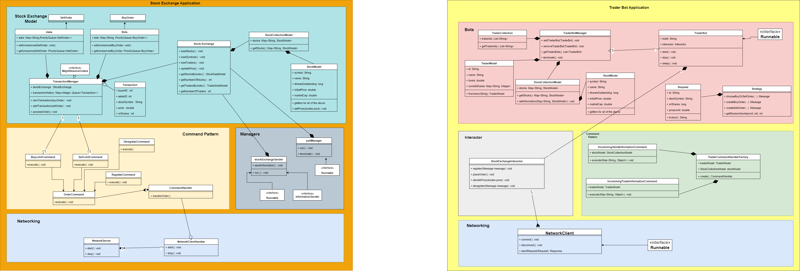

<br />
<p align="center">
  <h1 align="center">Stock Market Simulation</h1>

  <p align="center">
    < A simple stock exchange simulation run by trader bots>
  </p>
</p>

## Table of Contents

* [About the Project](#about-the-project)
  * [Built With](#built-with)
* [Getting Started](#getting-started)
  * [Prerequisites](#prerequisites)
  * [Installation](#installation)
  * [Running](#running)
* [Modules](#modules)
* [Notes](#notes)
* [Evaluation](#evaluation)
* [Extras](#extras)

## About The Project

<!-- Add short description about the project here -->
In this project, we have created a simulation of a stock exchange. A Trader (bot) are free to buy or sell stocks from the stock market. The orders implemented in this project are limit orders. When an order is resolved, the price of stock in the stock exchange is updated to the resolved price and the trader's information will also be updated. 

## Getting Started

To get a local copy up and running follow these simple steps.
1. In the Github Repo, Click on the green Code button and copy the URL.
2. Go to Git Bash and go to the folder you want the program to be located.
3. Type git clone URL where URL is the previously copied URL.
4. The folder will now appear in your local device. To open the program, head to the POM.file.

### Prerequisites

* [Java 17](https://www.oracle.com/java/technologies/javase/jdk17-archive-downloads.html) or higher
* [Maven 3.6](https://maven.apache.org/download.cgi) or higher

### Installation

1. Navigate to the `stocks` directory
2. Clean and build the project using:
```sh
mvn install
```

### Running
1. Download MultiRun Plugin.
    -  Press Ctrl+Alt+S to open the IDE settings and select Plugins.
    -  Find MultiRun in the Marketplace and click Install.
2. Select Run tab and click on Edit Configurations.
3. Select the + and find MultiRun.
4. Rename the MultiRun and add StockExchangeMain and TraderApplicationMain into configuration.
    -  Make sure that you add the two mains in the correct order.
5. Add a 0.5s delay, if necessary.
6. Click on Apply and then OK.
7. To run the program, Hit the run icon on the top right.
<!--
Describe how to run your program here. These should be a few very simple steps.
-->

## Diagram



## Modules

<!--
Describe each module in the project, what their purpose is and how they are used in your program. Try to aim for at least 100 words per module.
-->
This Program is made up of 7 Modules.
### message-queue
The message queue module is made up of classes which main functionality is to create a message queue and allow producers
and consumers to enqueue and dequeue from the message queue. In our program, the stock application starts a message queue. 
All buy or sell orders are sent from the stock-client to the stock-server via this message queue.

### networking
The networking module contains the interaction between the client-side and the server-side. All the classes in this module 
implements the Runnable interface. The main aim of this module is to establish a connection between the server and the client.
In the program, The stock application is the server and each trader bots are the clients. Every message (i.e register, 
deregister, MqPut, BuyLimit, SellLimit) from the client are sent via the network and handled my the clientHandler in the 
server side. Similarly, messages (incoming) from the server side are sent through the network and handled by the client. 
This is the communication between the client and server side.
### command
The command module is an implementation of the command pattern. Every request is wrapped under an object as a command and 
passed into an invoker. If the command passed has an appropriate object, the command will be executed. In this program, 
the command pattern is used to handle all the actions between the stock application and trader application. The commands
available in this program are as follows:
- MqPut : enqueue a message into a message queue.
- Register : Register a trader bot (client) into the server.
- Deregister : Deregister a trader bot from the server.
- BuyLimit : sends a buyLimit request and creates a buy order and attempts to resolve it.
- SellLimit : sends a sellLimit request and creates a sell order and attempts to resolve it.
- IncomingTraderInfo : sends information about specific trader from the stock application to trader application.
- IncomingStocksInfo : sends information about all stocks from stock application into trader application.

### stock-server
The stock-server module contains all the classes related to the stock application. In this module, a server is initially 
created. With th creation of this server, a stock exchange is initialized. The stock exchange will create a message queue,
a local consumer whose job is to dequeue from this message queue and a factory which contains the commands related to the 
stock application. This factory creates a commandHandler which is used by the messageHandler. Nevertheless, the stockExchange
will also load the yaml file of the traders, stocks, and stock symbols. Lastly, they will initialize the following:
- Poll Manager : this class is responsible on continuously polling from the previously mentioned message queue. Once a message
is polled from the queue, it will execute commands based on the message header.
- Transaction Manager : this class is responsible on resolving all the buy and sell limit orders. If a message polled by the 
pollManager has a header of BuyOrder or sellOrder, the transaction manager is called, and it will resolve the orders.
When an order isn't able to be solved, it is added to the bids and asks.
- Connection Manager : this class is responsible on keeping track which clients are connected. If a client is connected, they
will receive the information of themselves and of the stocks.
- StockExchangeSender: This class is responsible for continuously sending information of trader and stocks.  

### stock-client
The stock-client module generates a number of trader bots who acts as the client. When first initialized, these bots will
register themselves in the stock exchange by sending a register message. Once they are registered, they are free to create
buy or sell limit orders. For buy orders, they will be able to purchase any of the available stocks given that their funds 
are sufficient and for sell orders, they can only sell stocks that they owned. These bots are able to make an order every
1 to 4 seconds.
### stock-market-ui
The stock-market-ui module is made up of classes which creates the view of the program.

### util
The util module contains the YamlLoader which is used in the stock application and trader application to load the stocks and trader.


## Design
<!--
List all the design patterns you used in your program. For every pattern, describe the following:
- Where it is used in your application.
- What benefit it provides in your application. Try to be specific here. For example, don't just mention a pattern improves maintainability, but explain in what way it does so.
-->

### Singleton
Singleton is a design pattern that allows only one instance of a class. In our program, this can be found in the stock exchange.
This is beneficial as it prevents other object from instantiating their own copies of the singleton object. As a result, 
all objects access that single instance.

### Command
The command pattern is used on both the Stock Application and the Trader Application. The command pattern treats requests 
as objects and passed it to an invoker where that command is executed. You can find seven different commands in the program, 
as previously mentioned in the command module section above. Five of these seven commands are executed by the stock application 
while the remaining two by the trader application.

A command pattern has multiple commands that each implement the Command interface. This is beneficial as this allows us 
to decouple the "sender" and "receiver". Now, the sender will only call execute() and the receiver will know what to do.
the behaviour of the handler is no longer defined solely by the handleMessage method but outsourced to each command classes.
As a result, we have a much cleaner architecture of our system making it more maintainable.

### Facade
The facade pattern provides a simplified interface to a library or framework. In our program, you can find the facade pattern
in the StockExchangeInteractor in the stock-client module. We see the stockExchangeInteractor as the UI of the application
where it should only have simple methods. The implementation of these methods are done in other classes. The facade pattern 
used is beneficial as it simplifies the integration of complex library into other library. This way, we only need to know how 
the behaviour exposed by the facade pattern works, saving time and effort in understanding and integrating codes.

### Factory
The factory pattern can be found in the message queue, stock-server and stock-client module. In each of this module, 
you will see a factories package that contain the factory. The factory pattern allows us to create objects without specifying 
the exact class to create. As a result, it delegates the creation of an object to another class. This is advantageous as 
we are following the black box principle where we are able to hide the internals of the main class.


## Evaluation

<!--
Discuss the stability of your implementation. What works well? Are there any bugs? Is everything tested properly? Are there still features that have not been implemented? Also, if you had the time, what improvements would you make to your implementation? Are there things which you would have done completely differently? Try to aim for at least 250 words.
-->
The program is very stable. There are no bugs that arise when running the program over a long period of time. However, 
the current program lacks tests. Given the amount of time, we were not able to create tests for everything. This will  be one 
of the possible improvement to the programs.

All the features that are mentioned in the other markdown file (1_questions, 2_networking, 3_stonks) are completed except 
for the NetworkConsumer from the second assignment bonus. If we had more time on the project, we would have used the strategic
pattern for the trading strategy.


For future improvements, we can add several features such as:
- Market orders,
- Possibility to cancel buy orders.
- Request Transaction history command.

<!--## Extras
-->

<!--
If you implemented any extras, you can list/mention them here.
-->

___


<!-- Below you can find some sections that you would normally put in a README, but we decided to leave out (either because it is not very relevant, or because it is covered by one of the added sections) -->

<!-- ## Usage -->
<!-- Use this space to show useful examples of how a project can be used. Additional screenshots, code examples and demos work well in this space. You may also link to more resources. -->

<!-- ## Roadmap -->
<!-- Use this space to show your plans for future additions -->

<!-- ## Contributing -->
<!-- You can use this section to indicate how people can contribute to the project -->

<!-- ## License -->
<!-- You can add here whether the project is distributed under any license -->


<!-- ## Contact -->
<!-- If you want to provide some contact details, this is the place to do it -->

<!-- ## Acknowledgements  -->
